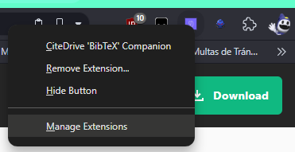
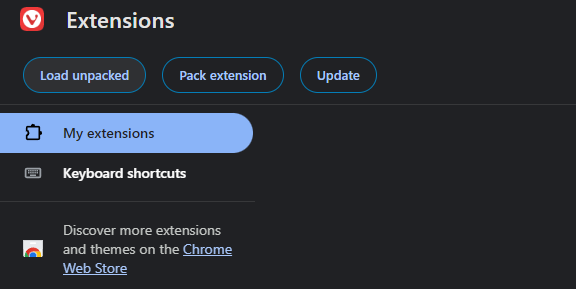
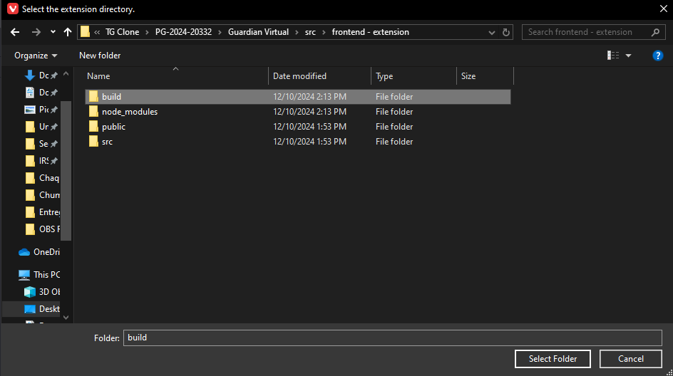
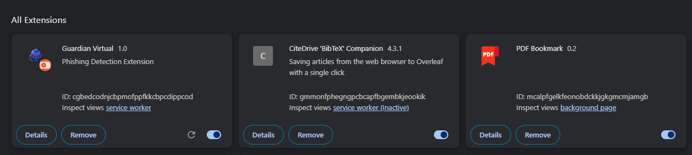

# Guardián Virtual: Propuesta de herramienta para la protección contra el phishing basado en mensajes, URLs y contenido de páginas web
 

El presente trabajo de graduación aborda la creciente amenaza de phishing, una técnica
de ingeniería social utilizada por ciberdelincuentes para obtener información confidencial, como credenciales bancarias o datos personales. Investigaciones previas han desarrollado soluciones para detectar y mitigar estos ciberataques; sin embargo, la gran mayoría de estas soluciones proponen la detección de solo un posible vector de ataque. Este trabajo propone una extensión web de detección de phishing que combina detección por listas y por machine learning, enfocada a la detección de ataques por medio de mensajes, URLs y contenido web.
Se logró obtener una alta precisión en los modelos de machine learning de la herramienta,
logrando una alta robustez ante diferentes ataques de phishing. Este trabajo pretende ayudar a la evaluación de diferentes enfoques para el desarrollo de herramientas dedicadas a la detección y mitigación de phishing.
## Instrucciones de Instalación
Pasos necesarios para configurar y ejecutar el proyecto en un entorno local

### Requisitos Previos
Para poder ejecutar correctamente el proyecto se debe contar con lo siguiente:

* Node 20.17.0^
* NPM 10.8.2^
* Python 3.10.5^
* Navegador con Chromium versión 130.0.0.0^

### Comandos para instalar el proyecto
```
git clone https://github.com/andresdlRoca/PG-2024-20332/
cd PG-2024-20332/Guardian\ Virtual/src/
```

#### Instalación de modelos de Machine Learning
```
cd PG-2024-20332/Guardian\ Virtual/src/backend/models/
```

Descargar el siguiente archivo:
https://www.mediafire.com/file/hrobgmkl1l5aruy/models.rar/file

Descomprimirlo en el directorio PG-2024-20332/Guardian\ Virtual/src/backend/models/ de tal forma que se obtengan 4 nuevos archivos .pkl:

* content_RF_model.pkl
* msgs_Extra_Trees_model.pkl
* tfidf_model.pkl
* url_Extra_Trees_model.pkl

### Variables de entorno
Para configurar las variables de entorno se debe ingresar al directorio backend
```
cd PG-2024-20332/Guardian\ Virtual/src/backend/
```
En el cual se debe crear un archivo ".env", en donde se contengan las siguientes variables:

```
GOOGLE_API={GOOGLE_SAFE_BROWSING_API_KEY}  
OPENPAGERANK_API={OPENPAGE_RANK_API_KEY}
```

Las cuales pueden ser obtenidas en los siguientes enlaces:

* Google Safe Browsing API: https://developers.google.com/safe-browsing/
* OpenPageRank API: https://www.domcop.com/openpagerank/auth/signup


### Ejecución de la aplicación

#### Backend
```
cd PG-2024-20332/Guardian\ Virtual/src/backend/
./init_setup.sh
```

#### Frontend
Para la extensión primero se debe crear el directorio necesario para poder ejecutar la extensión en el navegador:
```
cd PG-2024-20332/Guardian\ Virtual/src/frontend\ -\ extension/
npm install
npm run build
```

Ahora se debe inicializar el navegador chromium de su elección y en la barra de extensiones se debe de seleccionar la opcion "Manage Extensions".  


Esto nos llevara a una nueva ventana donde podemos elegir cargar una extensión desempaquetada.  


En el explorador de archivos se debe de seleccionar el folder build/ que se creo con el comando "npm run build"


Posteriormente, se puede observar en la ventana del navegador que la extensión ya se encuentra disponible para utilizarse.


## Demo
[Demostración visual del proyecto en acción](./Guardian%20Virtual/demo/demo.mp4)

## Informe Final

[Informe Final del proyecto de graduación](./Guardian%20Virtual/docs/Informe.pdf)
